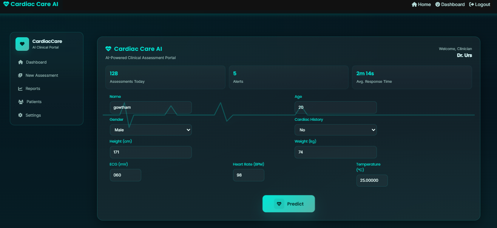
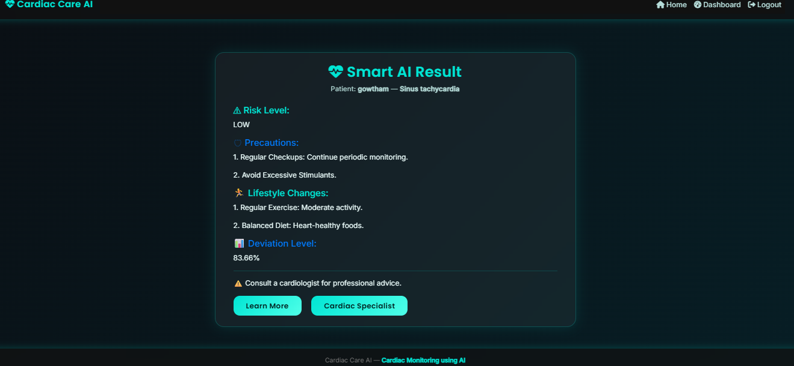

# Cardiac Care AI ❤️

Cardiac Care AI is an intelligent web application designed to **analyze ECG data and provide cardiac health insights**. It uses AI to detect arrhythmias from uploaded ECG recordings.

---

## Features
- Upload ECG recordings for analysis
- AI-assisted arrhythmia detection
- View ECG results and interpretation
- Snapshot capture and data export
- Interactive and user-friendly dashboard

---

## Tech Stack
- **Frontend:** HTML, CSS, JavaScript
- **Backend:** Flask (Python)
- **AI Model:** Pre-trained CNN for ECG classification
- **Database:** IndexedDB / Optional SQL
- **Deployment:** Local server / Cloud

---

## Screenshots
Dashboard 



Cardio Analysis

 

---

## Getting Started
### Clone the Repository
```bash
git clone https://github.com/gowthamurs07/cardiac-care-ai.git
cd cardiac-care-ai

## License
This project is licensed under the MIT License.

